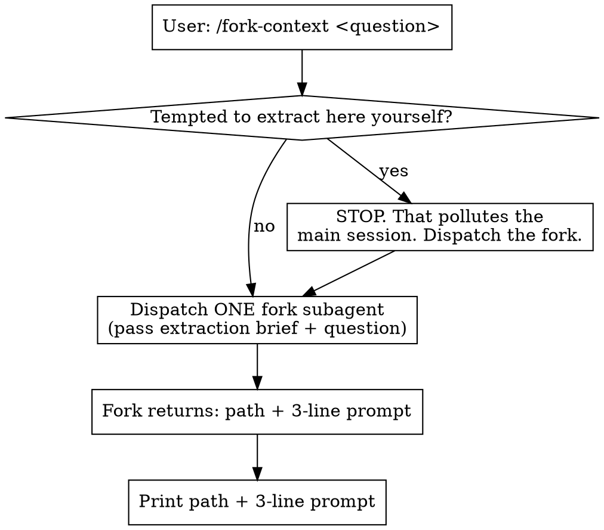

# fork-context

## Overview

You are deep in a long session (e.g. tuning some platform's performance, having
tried many ideas). A **related but tangential** thought surfaces ("could the
memory allocator be involved?"). You want to explore it in a **clean context**,
without dragging the whole history along and without **derailing the current
session**.

This skill extracts only the context relevant to that tangent into a
self-contained brief file, and prints a 3-line paste-prompt you copy into a fresh
`claude` session.

**Core principle:** the current session must stay clean. So the extraction work
(rescanning the conversation, composing the brief, writing the file) happens
inside a **`fork` subagent** — which inherits this conversation but runs in
isolated context. The main session only dispatches it and prints the result.

## The one rule that makes this work

**In the main session, your ONLY action is to dispatch a `fork` subagent. You do
NOT rescan the conversation, compose the brief, or write the file yourself.**

If you do that work in the main session, every token of it lands in the current
context — the malloc tangent, the brief, all of it — which is exactly what the
user is trying to avoid. The fork exists to quarantine that work.



## Step 1 — Main session: dispatch the fork

If no tangent question was passed as an argument, first ask: "你想分叉到哪个话题？"
Then dispatch a single `fork` subagent (Agent tool, `subagent_type: "fork"` — it
inherits this full conversation and runs in the background, keeping its work out
of your context). Pass it the user's tangent question verbatim plus the
extraction instructions in Step 2.

Do nothing else in the main session until the fork returns.

## Step 2 — Fork: extract and write the brief

Instruct the fork to do the following (it can see this whole conversation):

1. **Relevance-filter** the conversation against the tangent question. Pull only
   what relates to it — NOT a full transcript dump.
2. **Make it self-contained.** The new session has zero background. Expand every
   pronoun and shorthand ("it", "that approach", "上次那个") into concrete names,
   paths, and numbers a cold reader can follow.
3. **Preserve what's been ruled out.** Explicitly list ideas already tried and
   found ineffective, so the new session doesn't repeat them.
4. Write a markdown file to the **current working directory**, named
   `fork-context-YYYY-MM-DD-<slug>.md` (timestamp + a short slug from the tangent,
   so repeated forks don't clobber each other), with these 5 fixed sections:

   | Section | Contents |
   |---|---|
   | 背景与目标 | What's being worked on, the goal, environment/hardware/software-stack facts. The "scene". |
   | 已试过的方案与结果 | Approaches tried, each result, what's been disproven/ruled out. |
   | 关键数据与结论 | Key numbers/metrics/profiling results, conclusions already established. |
   | 与新话题的连接点 | Why this tangent surfaced — which symptom/dead-end raised suspicion toward it. |
   | 来源溯源 | Which files/paths/parts of the conversation this brief was distilled from, so the new session can trace back to the originals. |

5. **Self-check traceability (hardening).** This whole skill rests on the fork
   inheriting the *full* conversation. But in a very long session the inherited
   context may have been summarized/compressed rather than passed verbatim — and
   the main session deliberately never reads the brief, so a degraded brief would
   go unnoticed. Guard against it: for each key fact (numbers, ruled-out reasons,
   what a pronoun points to), confirm you can trace it to a concrete source. Any
   fact you cannot trace to the original, mark in 来源溯源 as "据摘要，未能追溯到原文"
   rather than stating it as certain.
6. **Return MINIMALLY.** The fork's final message must contain ONLY: the brief
   file's absolute path, and the paste-prompt below. It must NOT echo the
   brief's full text back — that would re-pollute the main session.

## Step 3 — Main session: print the result

Print the fork's two outputs: a one-line path confirmation and the paste-prompt
the user copies into a fresh `claude` session. The paste-prompt embeds the user's
tangent question verbatim and the brief's absolute path, and tells the new session
to **delete the brief after reading it** — the brief is a one-shot handoff, and
其溯源段已指向原始记录，so deleting it loses nothing and avoids stale files piling up:

```
我从另一个会话分叉出一个新话题。背景见 <绝对路径>/fork-context-2026-06-25-malloc.md，
请先读它，读完后删除该文件（它只是一次性的上下文交接件，溯源信息已指向原始记录）。
我的问题是：<用户的分叉问题原文>
```

## What this skill does NOT do

- It does not let the subagent answer the tangent itself. The product is a brief +
  prompt; the user explores the tangent themselves in the new session.
- It does not try to auto-open a top-level session (a skill can't).

## Common mistakes

| Mistake | Fix |
|---|---|
| Rescanning / composing the brief in the main session | Dispatch the fork. The main session only dispatches and prints. |
| Fork returns the full brief text | Fork returns ONLY path + 3-line prompt. The brief lives in the file. |
| Dumping the whole transcript into the brief | Relevance-filter against the tangent question. |
| Brief full of "it"/"that approach" | Expand every reference into concrete names/paths/numbers — the new session is cold. |
| Relative path in the paste-prompt | Use an absolute path so a session started in any directory can read it. |
| Stating facts as certain when the inherited context looks summarized | Mark untraceable facts in 来源溯源 as "据摘要，未能追溯到原文". |
| Paste-prompt omits the delete instruction | Include "读完后删除该文件" — the brief is a one-shot handoff, not an archive. |
