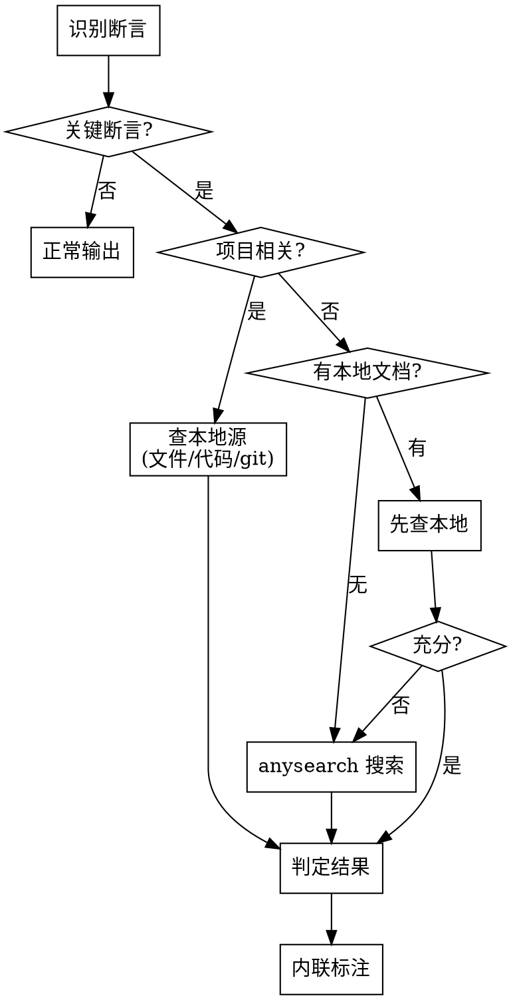

# Verify Claims

对输出中的关键断言进行验证并内联标注，确保结论建立在可靠证据之上。

## 触发条件

### 自动触发

输出包含以下内容时进入验证流程：

- 具体版本号、日期、数值、API 行为、工具特性
- 后续结论依赖的因果推理链
- 用户可能直接执行的技术建议
- 易产生幻觉的领域（兼容性矩阵、具体参数值）

### 用户触发

用户说"验证一下"、"verify"、"check this"等指令时，对已有输出进行验证。

### 不触发

纯代码生成、简单问答（"什么是 TCP"）、闲聊、用户明确说跳过。

## 断言分类

| 类型 | 示例 | 何时为"关键" |
|------|------|-------------|
| **事实性声明** | "PyTorch 2.6 支持 CUDA 12.4" | 具体版本号、日期、数值、API 行为 |
| **因果推断** | "HugePages 降低 TLB miss 从而提升吞吐" | 后续结论依赖此推理链 |
| **技术建议** | "设置 NCCL_SOCKET_IFNAME=eth0" | 用户可能直接执行，错误造成实际影响 |

### 筛选规则（自动触发时）

- 后续结论依赖该断言 → 必须验证
- 断言出错会导致用户执行错误操作 → 必须验证
- 属于易幻觉领域（版本号、具体参数值、兼容性矩阵）→ 必须验证
- 广泛已知的常识 → 跳过

用户触发时，以上规则 + 用户指定的任意断言均需验证。

## 验证流程



### 验证来源优先级

| 断言类型 | 首选来源 | 次选来源 |
|----------|----------|----------|
| 项目相关事实 | 本地文件、代码、git 历史 | — |
| 版本/API/兼容性 | 本地文档（如有） | anysearch 搜索官方文档 |
| 因果推断 | 本地实验数据/文档 | anysearch 搜索（需 ≥1 个独立来源） |
| 技术建议 | 本地配置和历史 | anysearch 搜索官方文档 |

## 判定与标注

### 判定标准

- **✅已验证**：找到可靠来源明确支持
- **⚠️部分验证**：找到相关信息但不完全匹配，或来源可靠性一般
- **❗未验证**：未找到支撑，或找到矛盾信息

### 标注格式

内联标注，紧跟断言之后：

```
Megatron-LM v0.15.3 不再依赖 Apex [✅已验证: pyproject.toml 中无 apex 依赖]

使用 HugePages 可以降低 TLB miss 从而提升训练吞吐 [⚠️部分验证: TLB miss 降低有据，吞吐提升幅度因场景而异]

建议设置 NCCL_ALGO=Ring 以获得最佳性能 [❗未验证: 官方文档未推荐固定算法，NCCL 自动选择通常更优]
```

### 标注规则

- **必须使用 emoji 前缀**：`[✅已验证: ...]`、`[⚠️部分验证: ...]`、`[❗未验证: ...]`。不带 emoji 的 `[已验证]` 是格式错误
- 来源说明一句话点明出处或原因
- 标注紧跟断言，不另起段落
- 验证发现断言有误时，**直接修正断言内容**并标注修正原因，不保留错误断言
- 非关键断言正常输出，不标注

### 效率控制（自动模式）

- 自动模式下，只验证最关键的断言（通常 3-5 个），不逐条验证所有声明
- 同类断言（如多个版本号出自同一来源）可合并验证，只标注一次来源
- 优先验证用户最可能直接执行的建议和最容易出错的事实

## 自动 vs 用户触发

- **自动模式**：只验证影响结论的关键断言，保持输出效率
- **用户模式**：关键断言 + 用户指定的任意断言，覆盖更全
